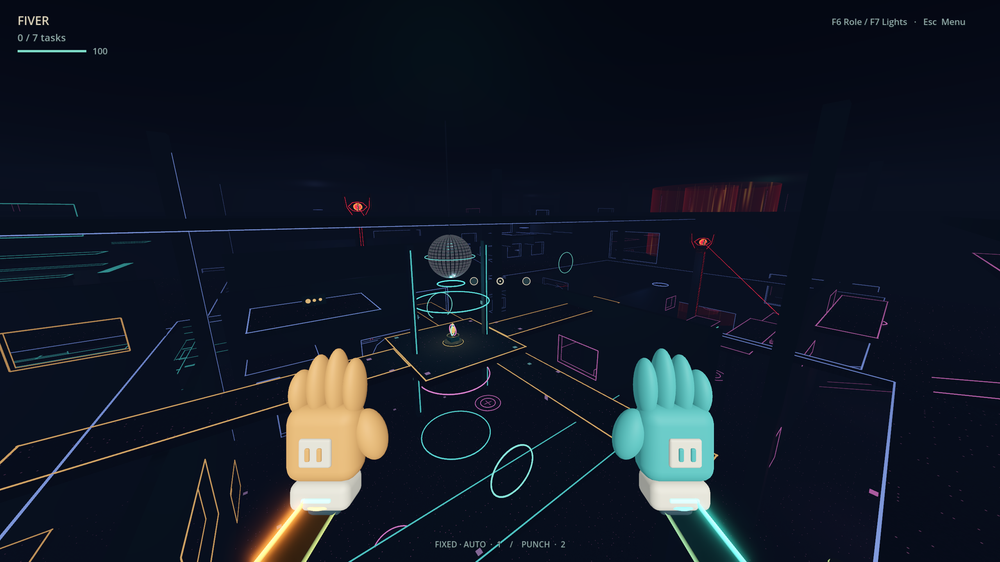
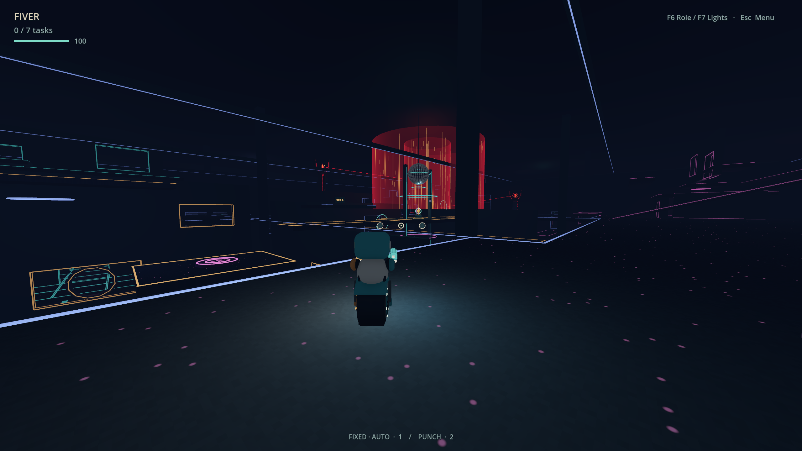
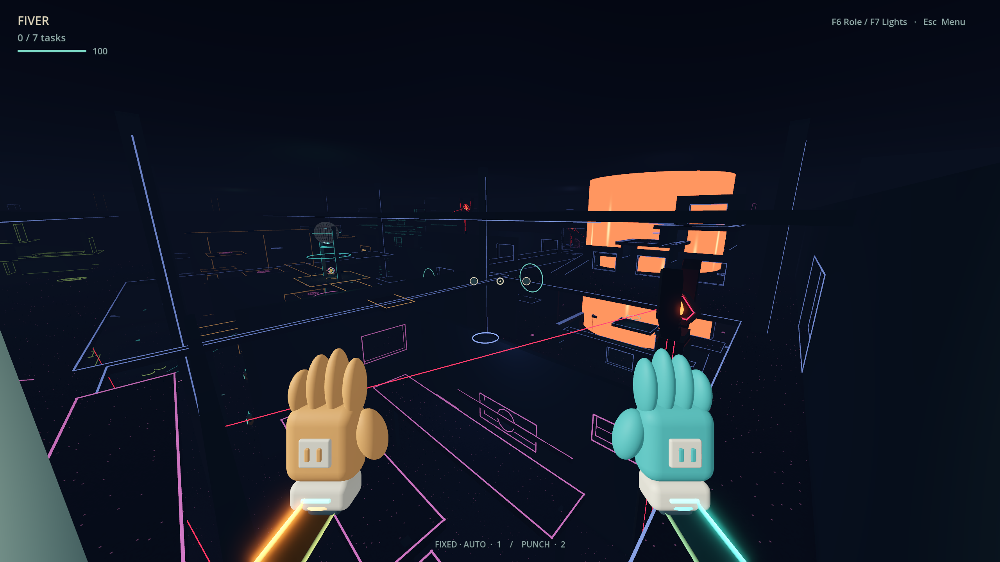

# Don’t High Five

Sticky hands. Ridiculous movement. Glowing danger.

A first-person movement playground with slingshot gloves, a wheel robot and powerful Watcher towers. **Local prototype; multiplayer is planned.**

[**Download for Windows**](https://github.com/Timothy-Cao/dont-high-five/releases/latest) · [Controls](docs/PLAYING.md) · [Map workshop](docs/MAP-EDITING.md)

Extract the ZIP and run **Play.cmd**. Godot is included; the first launch imports assets. **F5** changes camera, **F6** switches roles, **M** toggles the arena map, **Esc** opens settings.

Built with **Godot 4.7.2**. [Development](CONTRIBUTING.md) · [Design notes](docs/design/README.md) · [Asset credits](licenses/README.md)
