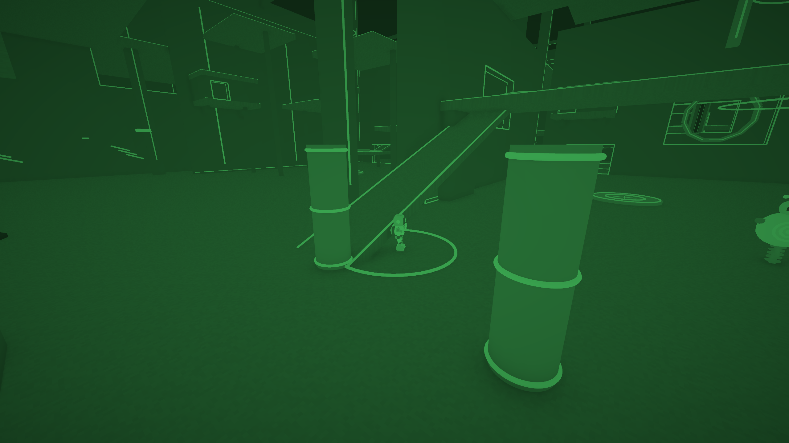
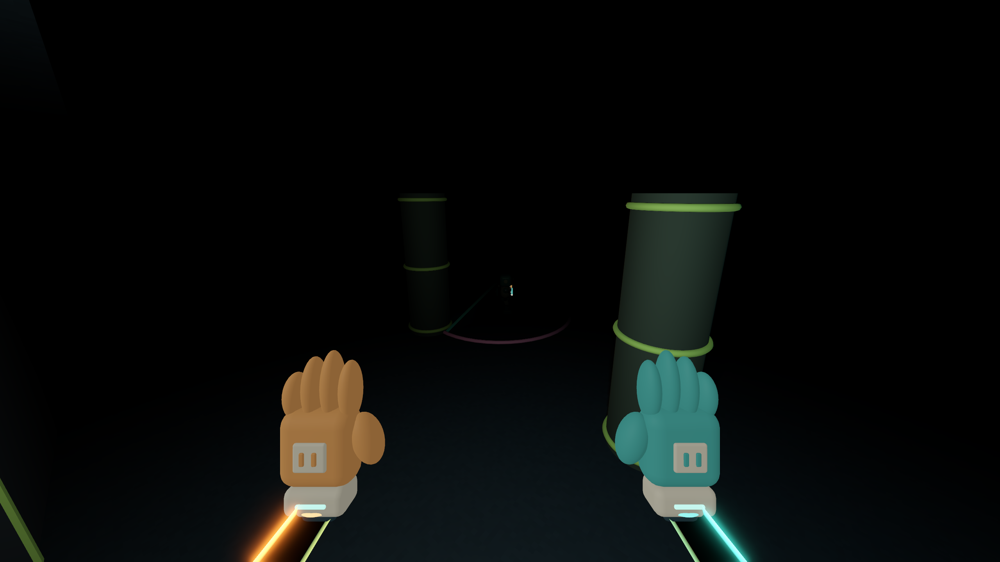
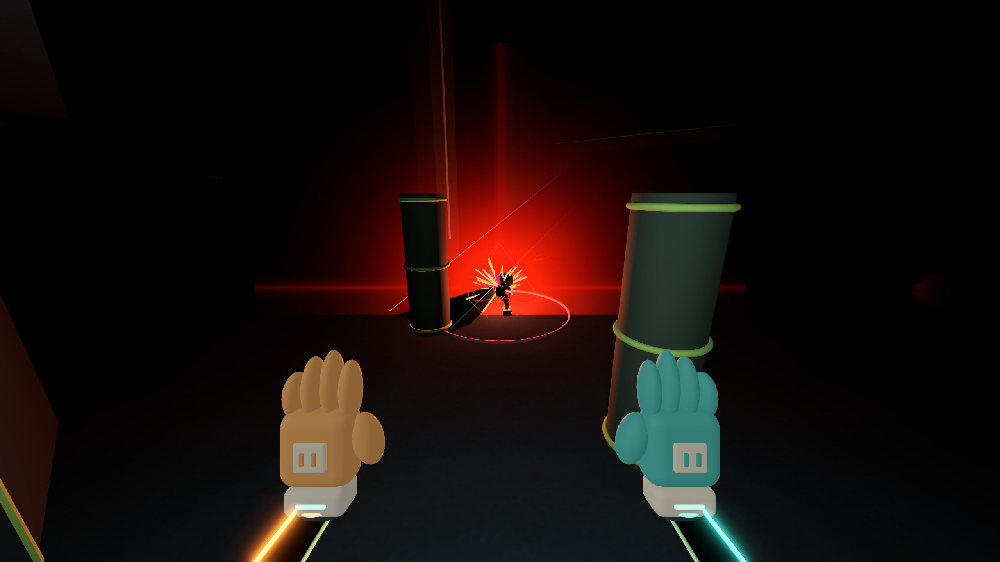

# One-hand cargo, weapon pacing and asymmetric blackout

## Cargo ownership

The occupied hand now survives E launches, ordinary recall, braking/anchoring and launch pads. Portals transform the cargo with its carrier and reject a transfer when either body would collide at the destination. Cargo follows through collision sweeps with speed headroom above the carrier's velocity; distance alone no longer discards it. Click the same hand used for pickup to explicitly drop it, including while braking. Delivery consumes it normally; death, role switch and reset still clear inventory as lifecycle actions.

With cargo, the free hand can stretch and slingshot using E. In fixed mode a click on its existing grip immediately fires the next grip, rather than requiring a separate recall click. E releases the traversal grip while keeping cargo and earned velocity. This is one-handed traversal: between grips there is a brief ballistic phase, and a miss leaves no backup hand. Two-handed punch/zip remain unavailable.

## Weapons

- Manual machine gun: **30 rounds/s**, up from 10; spread parameter **0.036**, up from 0.018. Damage remains 8. Optional automatic-tower target scheduling is unchanged.
- Sniper: **0.7 s** repeat interval; 55 damage, half-speed scoped look on both axes. HUD recharge uses the new interval.
- Grenade: loses most velocity on contact; slight wall deflection then falls. On a supporting surface it settles and begins a **1 s** fuse. No launch-time detonation timer; a 20 s safety limit removes escaped ordnance with a blast.
- Airstrike: a single ceiling-clipped, world-vertical warning laser flashes for the existing **2.8 s** warning, followed by the energy strike. No circular or corner-bracket ground warning.

## Blackout

The world remains dark. Only the Watcher camera receives a brighter private Environment and green monochrome display filter, drawn before HUD text. Switching to Fiver removes that camera override/filter. No global ambient light is restored for night vision. The filter compresses highlights so a flash is less disruptive to the Watcher than to a Fiver.

Gloves use private emissive materials, including the local simulated partners' gloves, and remain visible in darkness without making entire robots emissive. First-person glow is quieter to preserve hand shape. Real hand lamps still illuminate nearby cover. Shots add bounded impact-light pulses (ten pooled lights, 0.16 s lifetime), alongside muzzle light. Existing explosions reveal nearby geometry briefly before it returns to darkness. This is local camera behavior, not tested network replication.

## Evidence

Full regression: **14 suites / 607 checks** passed. The final explicit-drop edge case raises the dedicated suite to 23 checks; its rerun and the 24-check settings/UI regression passed after the last edits. Source audit: **113** resource references plus UID/authoring checks.

The dedicated carry/night suite passes **23/23** checks: both hand ownerships, elastic/fixed E, pad/portal retention, fast cargo tracking, same-hand ceiling regrips, explicit drop, separate camera lighting, remote glove emission, temporary impact light, low grenade rebound, landing-relative fuse and vertical strike geometry. Five same-hand ceiling clicks cover **27.07 m** in the controlled scenario while retaining cargo.

Six authored 2560 × 1440 engine renders compare the same area with ordinary Watcher vision, green night vision, Fiver darkness, attack flashes and the vertical warning. Own-hand emission was reduced after the first review showed flattened glove shapes. No desktop input or interactive game launch was used. Certificate-store and shutdown resource warnings persist in the test environment.

