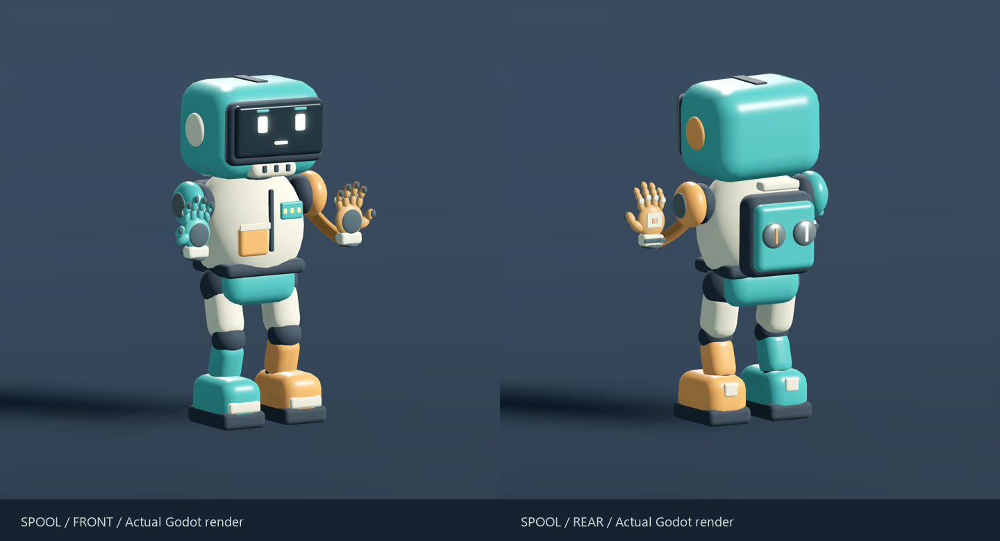
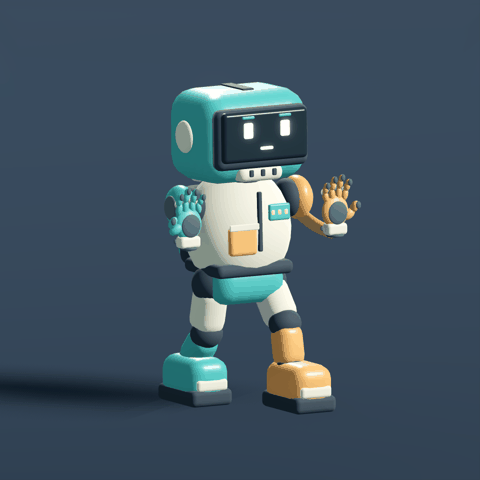

# Charged fists, earned momentum and Spool

Historical charge/rig pass; the recoil values below are superseded by [RECOIL-RAVE-PASS.md](RECOIL-RAVE-PASS.md).

21 September 2026. This was a local iteration; the published v0.1.0 package is an earlier snapshot.

## Play changes

| Parameter | Previous | This pass |
| --- | --- | --- |
| Walking speed | 7 m/s | 3.5 m/s |
| Ground acceleration | 100 m/s² | 12 m/s² |
| Ground release braking | 100 m/s² | 100 m/s² |
| Crouch speed | 3 m/s | 1.75 m/s |
| Speed generated by air input | Up to 9 m/s | Up to 3.5 m/s |
| Faster airborne momentum | Steering could reduce it | Direction rotates while magnitude is preserved |
| Bunny-hop contact | Immediate ground deceleration | 100 ms grace, with existing jump buffer |
| Two-button punch | Immediate, 25.5 m, 30 damage per fist | Release to fire; 4.5–25.5 m and 12–42 damage per fist |
| Charge duration | None | 1.1 seconds to full strength |

The movement hypothesis is that feet reposition you and hands supply traversal speed. Lower acceleration does not mean slippery stopping. A successful hop carries earned speed; continuous unassisted air input cannot build an unlimited strafe speed. Air steering still turns 30 m/s momentum by about 46 degrees in half a second. Missing the hop allows normal ground braking to settle you; Ctrl immediately brakes in air. Walls, launch pads, reels, elastic launch power and normal hand range retain their previous tuning.

The first mouse press still fires its normal glove instantly. A second press within 120 ms recalls it and starts charging. Release either button to attack; release both before another chord. Aim is sampled on release. Charging is cancelled safely by pause, recall, brake, suppression, reset or disabling the ability. Full charge waits for release rather than firing unexpectedly. Charge does not increase the ground-hop impulse: two ground contacts still produce exactly one roughly 2.25 m upward hop. This avoids an accidental charge-based vertical movement buff.

The small reticle ring, lower braced fists and rising elastic creak communicate charge without a new HUD panel. A first render put the fists too close to the camera; they were lowered and reduced so the scene remains visible.

## Character direction

**Spool** is a slightly anxious-looking maintenance toy: large rounded visor, little padded belly, chunky asymmetric boots and visible cable spools. Broad material regions make the character readable in the dark. Apricot left equipment and teal right equipment preserve hand identity. The face is sparse enough to remain recognizable when small on screen.

The editable Blender asset has twelve skeletal bones, one skinned mesh, eight material surfaces and 24,660 triangles. Rigid shells are weighted to their appropriate joints; this is an articulated robot rig, not a deforming human cloth rig. Every vertex is weighted. A direct GLB audit checked all 14,556 exported vertices (including normal/material splits): weights sum to one, there are twelve skin joints, and root tracks contain no travel. The main capsule still owns collision. Gloves and fists retain their existing independent models and projectile controller; the cable origins now follow animated shoulder bones.

Six original in-place clips ship in the GLB: **Idle, Walk, Air, Charge, Punch and Land**. The gait uses baked two-bone IK to keep the stance sole flat and lift the swing foot. Runtime walk speed follows distance travelled, backward travel reverses the cycle, and strafing turns the body. Blends are short. Charging while moving retains leg motion and adds a torso lean. Pause freezes animation. No root motion moves the controller.

The GIF is sampled directly from Godot's imported clip at its authoring speed. Studio lighting is brighter than the actual arena to expose geometry and joint problems. It is not multiplayer footage. The current rig does not solve feet against arbitrary slopes, and crouching still uses the existing visual height compression. Those are future polish work, not claims of a finished commercial character.

## Review and evidence

- Eight local suites cover 331 assertions, including actual projectile/dummy collision, parallel fist paths, tap misses versus charged hits, charge cancellation, movement acceleration, real landing/hop momentum, imported animation tracks, articulated feet and stance height.
- Both complete 120 m ramps and both suppression-room exits remain walkable at the reduced speed. Hurdle tests now use the shorter run-up appropriate to that speed.
- Measured normal walking stop: **0.0417 s, 0.0472 m**. Jump apex: **1.367 m**. Grapple rise over one second: **9.683 m**. These are deterministic controller measurements, not a human judgement of fun.
- Inspected actual front/back, walk, charge, airborne, F5 and first-person charge renders. Reviewed eight sampled poses across the complete 24-frame gait. A first-pass foot-contact error and excessive first-person fist occlusion were corrected.
- Reproduction: `Verify.cmd`; Blender `--background --python art/build_spool.py`; Godot `-- --avatar-capture` for the authored render harness. No desktop capture or system input is used.

## References and limits

The user's [LOCKDOWN Protocol reference](https://store.steampowered.com/app/2780980/LOCKDOWN_Protocol/?l=english) is a direction for simple readable characters, not a source of copied meshes or animations. The original robot keeps the established gloves, colors and elastic fiction of this project. Search excerpts from the [Blender glTF manual](https://docs.blender.org/manual/en/3.0/addons/import_export/scene_gltf2.html?highlight=gltf) describe skinning and action/NLA export. Full-page retrieval was blocked, so exporter properties were checked against the installed Blender and the resulting clips and skin were verified directly in Godot and the GLB.

Most useful next playtest: start still, reel into speed, turn in the air, land into a hop, then compare a tap against a full charged shot at the same dummy. Check whether the slower feet encourage hand use without making missed grapples tedious. Multiplayer combat balance is not established.
