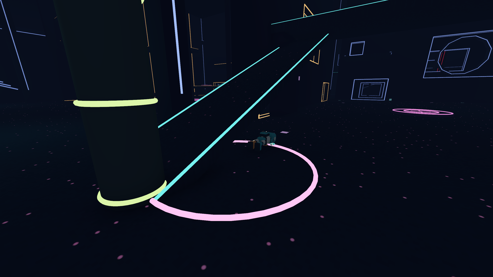
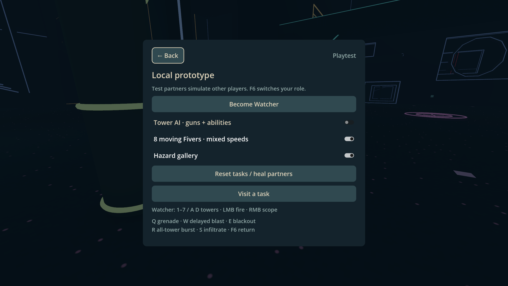
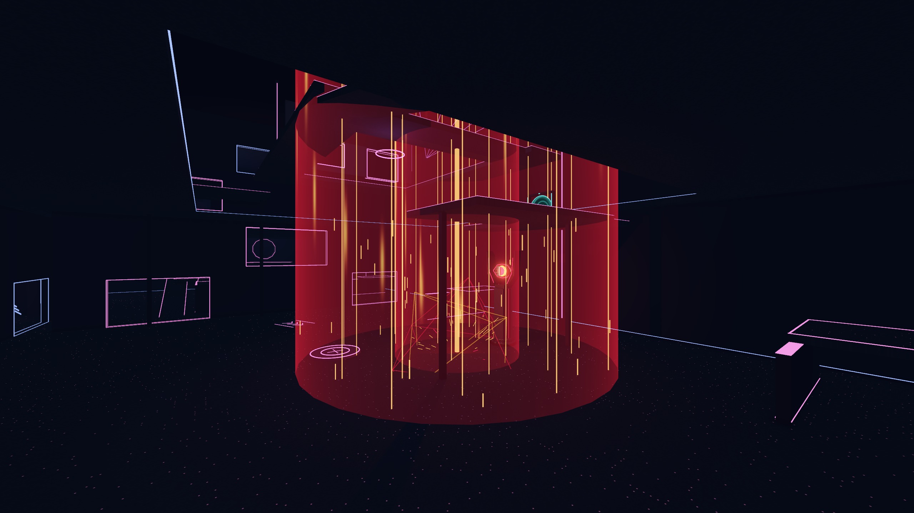

# Moving Fivers, automated towers and collapse

Open **Esc → Local playtest**. “8 moving Fivers · mixed speeds” and “Tower AI · guns + abilities” are independent, off-by-default switches. F6 still changes your local role. The tower you control is excluded from automation.

## Moving targets

Eight extra Fivers start near safe tower approach positions across the arena. Their speeds are 5, 8, 12, 18, 24, 30, 36 and 40 m/s; 40 is the player's current base maximum slingshot speed. They steer into shallow curved laps and probe walls/ledges to turn toward open floor. Character collision remains authoritative. They can be shot, knocked around or high-fived, and respawn after three seconds. Disabling the switch removes these eight without removing the task partners.

This is a local target simulation, not multiplayer or a navigation mesh bot that knows the whole map. Actors do not use grapples, plan tasks or intentionally jump between floors. The mixed speeds are useful for aiming and sightline tests; sustained player-like traversal is a later step.

## Automated danger

Towers 1/3/5/7 use snipers; 2/4/6 use machine guns. Snipers use the real 0.4-second cadence and red aiming lines. Machine guns use 30 rounds/sec during 0.6-second bursts, with an approximately 0.8-second rest. Both use real weapon damage, tracers, sounds and impact lighting.

Sight is sampled every 0.15 seconds within 160 metres. Towers prefer the visible local Fiver, then visible test partners. They shoot at snapshots at least 0.6 seconds old, with weapon spread and no velocity prediction. Fast lateral movement therefore leaves shots behind; standing still is dangerous. Losing sight clears acquisition; target changes require reacquisition. Blinding an eye, entering its operator seat or disabling the toggle cancels its targeting.

Each eligible tower independently throws grenades on the 0.5-second base timer and marks orbital strikes on the 5-second base timer, with small randomized extra delays and staggered startup. Grenades follow ballistic arcs toward old positions; strikes have a small random offset. Existing thrown grenades and marked strikes finish after the toggle is disabled. AI does not toggle blackout or infiltrate. Up to eight live orbital fields and 64 projectiles bound unattended stress tests.

## Death and vertical beam

Local players and partner Fivers share a cosmetic robot collapse: a brief tumble onto the back, inherited capped momentum, gravity and floor contact, then a short shrink-out before respawn. Hands remain emissive. The head stays attached in this pass. Corpses do not block traversal or take further damage. This is a scripted collapse, not an articulated physics ragdoll.

Orbital warning lines, curtains and filaments extend 180 metres upward, continuing through openings between levels. Opaque geometry still occludes rendering. Damage retains its previous ceiling and wall-cover rules: seeing a beam through an upper opening does not make all floors vulnerable.

## Verification

All sixteen verification suites passed (653 checks), then the expanded crowd suite passed 24/24 after adding safe reacquisition of a removed target: 654 distinct checks overall. The static resource/UID/authoring audit passed with 136 references.

The dedicated crowd suite covers actor counts, duplicate toggles, movement in the real arena, mixed speeds, pause, death/respawn/cleanup, delayed aim, both AI abilities, alternating guns, sustained machine-gun bursts, sightline loss, blinding, disabling and full-height filaments. Existing gameplay verification runs alongside it through `Verify.cmd`.

Authored 2560×1440 engine captures were inspected for the collapse, test menu and extended orbital field. These are scene renders, not desktop screenshots or a human playtest. Headless Godot reports a dummy-renderer material warning while retiring a corpse; the corresponding Vulkan capture has no material or script errors. Existing certificate-store and shutdown resource warnings also remain.

