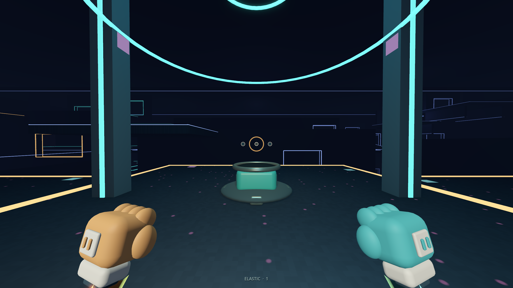
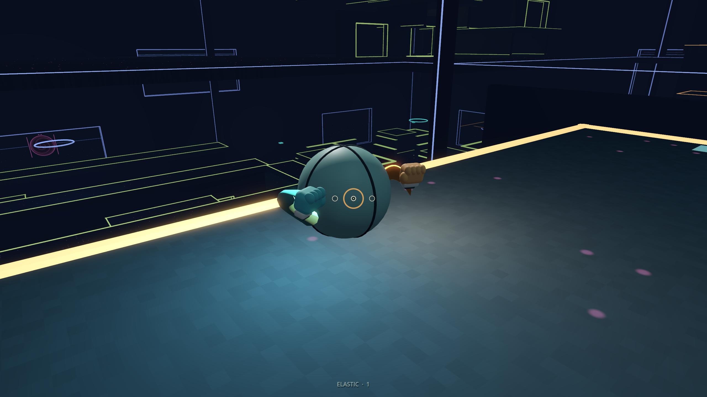
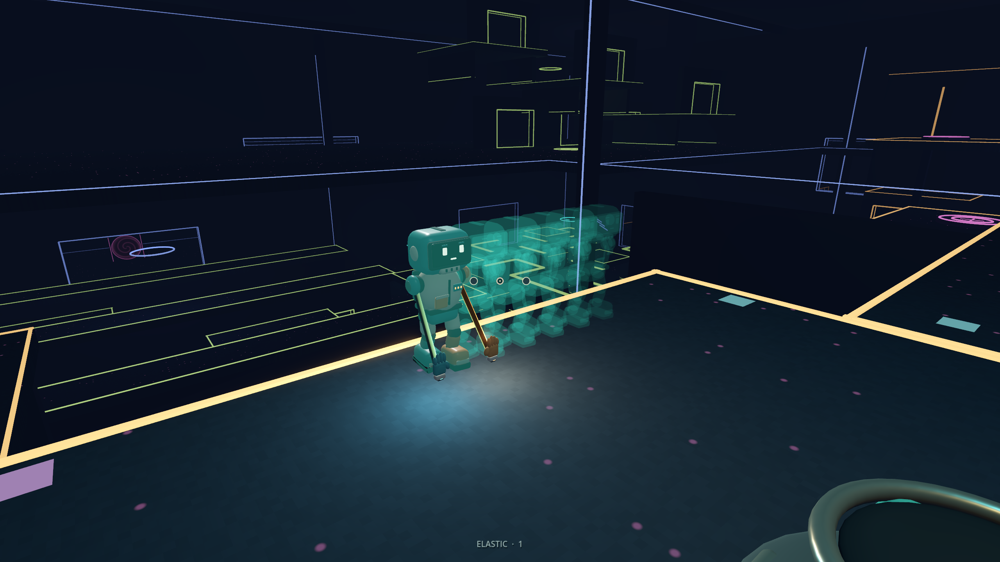
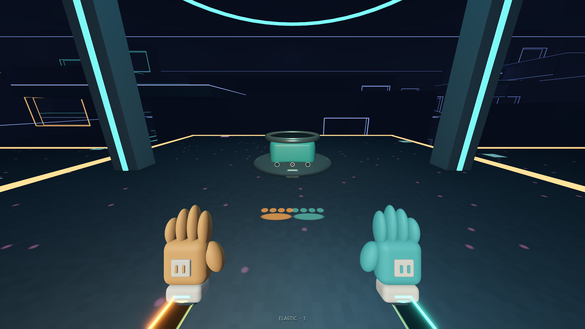

# Fiver movement pass — 2026-09-21

**Follow-up:** [Automatic ceiling traversal](AUTO-CEILING.md) supersedes the manual fixed-rope reeling described in this initial pass. Fixed mode now works with alternating clicks alone.

The new Fiver / Watcher brief is split into a playable traversal pass and a staged [backlog](design/IMPLEMENTATION-BACKLOG.md). [Research and design decisions](design/MOVEMENT-MODES.md) preserve direct sources, counterexamples and scope limits. Original user notes are saved [verbatim](design/FIVER-WATCHER-BRIEF.md).

## Implemented

- **1: elastic / fixed arms.** Fixed attachment captures distance. F or wheel shortens, E releases. Tangential speed is retained through a swing; the winch retains its inward velocity when released. There is no instantaneous 5 m snap. Successful alternate grips overlap for 0.3 s; a miss keeps the old hand.
- **Two-button recall versus charge.** A chord begun with extended hands recalls both. A fresh chord from idle charges a punch. Individual glove shots remain instant.
- **Nonlethal punches.** Paired fists deliver one additive impulse per recipient. Nearby hits repel both bodies. Moving dummies recover without a damage/health loop. Future networked players can use the same local receiver, but networking is not implemented.
- **Shift anchor, C grip, Ctrl brake.** Ground anchor refuses walking, jumping, incoming punches and automatic launch pads. Air anchor drops quickly. Saved custom bindings are migrated without colliding with new defaults.
- **Readable feedback.** Stronger charge pose, subtle continuous full-charge fist vibration, ball-level sockets and curved forearms, pooled speed silhouettes, optional five-degree speed FOV, rounded fading fist stamps. Near-camera ghosts fade out; reset clears trail history.
- **Arena adjustments.** Disabled the equipment field and removed its invisible projectile barriers/shader while keeping the sheltered bay. Every power station now replenishes 30 seconds after collection. Existing buffs stay temporary.

The tutorial, carryable ball, Watcher role/weapons/health/AI, high-five healing, tower sightline layout, single-maze consolidation and editable map kit remain staged work. The current arena size and primary routes are preserved for testing the new movement.

## Verification

The complete eleven-suite run passed **433/433** checks. Subsequent targeted verification expanded the new Fiver suite from 36 to **42/42**, adding coverage for continuous full-charge vibration, near-camera ghost fading, trail reset, custom-key migration and retained reel velocity. This brings current suite coverage to **439 assertions**; the final targeted suite passed after those changes. No script parse errors or test failures remain in these runs. Source/resource audit passes.

Highlights: ten-second 30 m/s orbits preserve speed/radius at 60 and 120 Hz; a gravity-driven swing reaches 21.91 m/s horizontally; the actual controller swings and reels; blocked reeling stops at a solid ceiling; old grip release, missed replacements, recall arbitration, target separation, anchor/pad interactions and bounded effect pools are tested. Existing recoil, movement, platform routes, portals, settings and full ramp walks passed in the full run.

Four 2560 × 1440 authored in-engine review frames were rendered and inspected. This used a self-terminating render harness, not desktop or browser automation. Review led to reducing ghost opacity, hiding near-camera silhouettes, clearing history on reset, rounding the stamps and fixing the capped-charge vibration clock. The afterimage frame deliberately stages several poses to expose the effect; it is not a multiplayer screenshot or a performance benchmark.

Godot still emits the environment's root-certificate warning and some teardown resource/ObjectDB warnings. These are not reported as clean engine logs. No live multiplayer performance, human fun score or Watcher balance is claimed.

## Try next

1. Press **1**, place a high hand while falling, swing under it, release with **E**.
2. Hold **F** to shorten to about 5 m and alternate ceiling grips. Deliberately miss once.
3. Use **LMB + RMB** to recall; release both, then hold a fresh chord and punch the ground.
4. Punch a nearby dummy, then one from farther away. Hold **Shift** on a launch pad and release it.
5. Use **F5** to review ball charge and speed silhouettes.

Close and reopen the game through `Play.cmd` to load this local pass. The public v0.1.0 release remains the older published snapshot.

## Reviewed images

