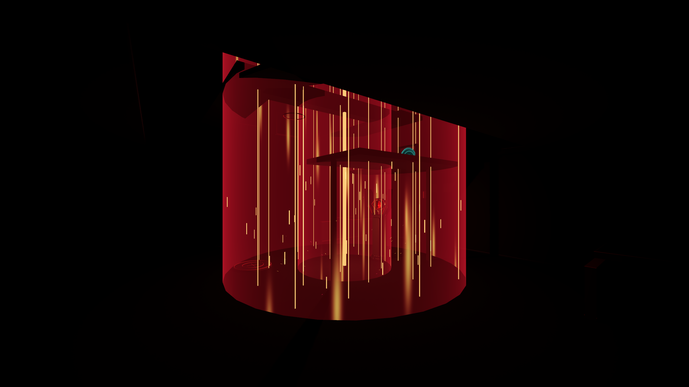

# Orbital strike and night-vision startup

## Timing

- Sniper interval: **0.4 seconds**. The existing scoped indicator reads this constant, so its recharge arc remains accurate.
- Grenade repeat: **0.5 seconds**. The low-rebound behavior and one-second landing fuse remain.
- Orbital strike repeat: **5 seconds**, counted from placing the warning. Its warning remains **2.8 seconds**.
- Watcher blackout: **0.5 seconds** without night vision, then a **0.45-second** sensor boot with two brief brightness dips and a fade into stable green. World darkness begins immediately. Existing hand/attack light sources remain visible during the dark beat. Startup freezes on pause; toggling lights on or leaving Watcher cancels it immediately.

## Distinct area attack

The former 10 m one-off area blast becomes an **18 m radius**, four-second column: 3.24 times the old horizontal footprint. It deals **70 damage per second**, in quarter-second ticks, within its radius and ceiling-clipped height. Solid cover blocks damage; it does not damage through floors into another room. Aim on a wall or actor is grounded onto the surface below when available.

The effect uses two translucent animated energy curtains, 25 ceiling-clipped beam filaments, 40 moving fragments, an ignition burst and local red lighting. Four original 48 kHz roar variations have a sharp ignition, sustained electrical body and power-down tail. The field owns its sound, so pause and cleanup match the damage/visual lifetime. All geometry, shaders and audio are original. Maximum four active field nodes; the normal cooldown permits fewer.

The warning remains a single flashing vertical laser, with no new ground-disc UI. The area becomes a much larger visible volume at ignition. This intentionally permissive local tuning still needs a human escape/readability test; no claim of competitive balance.

## Reference and critique

The user's Brimstone reference informed the warning-to-sustained-area-denial structure rather than a copied asset or exact game tuning. Riot's [patch 7.04 explanation](https://playvalorant.com/en-us/news/game-updates/valorant-patch-notes-7-04/) connects large-area ultimate frequency and duration to game-state clarity. Here the user explicitly requested a five-second repeat; the retained warning, solid-cover counterplay and bounded lifetime keep that local experiment readable. The [official Brimstone page](https://playvalorant.com/en-us/agents/brimstone/) was checked, but its accessible text exposed Incendiary rather than complete Orbital Strike details; no precise Valorant radius/damage values were inferred.

The design-atlas game-art workflow guided shared materials, bounded effects, lifetime tests and actual render review. Seven 2560 × 1440 render fixtures capture the dark beat, sensor startup, stable night vision, warning, active column, blackout column and extinguished area. Screenshots demonstrate appearance, not a frame-time benchmark.

## Verification

**203/203 focused checks passed:** orbital 22, pilot 134, carry/night 23 and settings 24. Source audit passed 123 resource references, UIDs and authoring syntax. Four new WAVs pass 48 kHz, -3 dBFS peak and quiet endpoint checks. This is a focused rerun; the expanded fifteen-suite runner is available for subsequent full regressions.

Focused suites cover night-vision delay/pause/cancellation, new weapon intervals, sustained damage beyond the former radius, safe targets outside the field, wall and floor cover, pause-synchronized sound, cleanup and exact cooldown rejection/readiness. Existing pilot and carry/settings checks also rerun. Engine certificate-store and shutdown ObjectDB/resource warnings remain; no desktop interaction or human listening/playtest is claimed.

Follow-up: [crowd and tower AI pass](CROWD-AND-TOWER-AI.md) extends orbital visuals to 180 m and raises the live-field bound to eight. The earlier ceiling-limited damage checks still apply.
