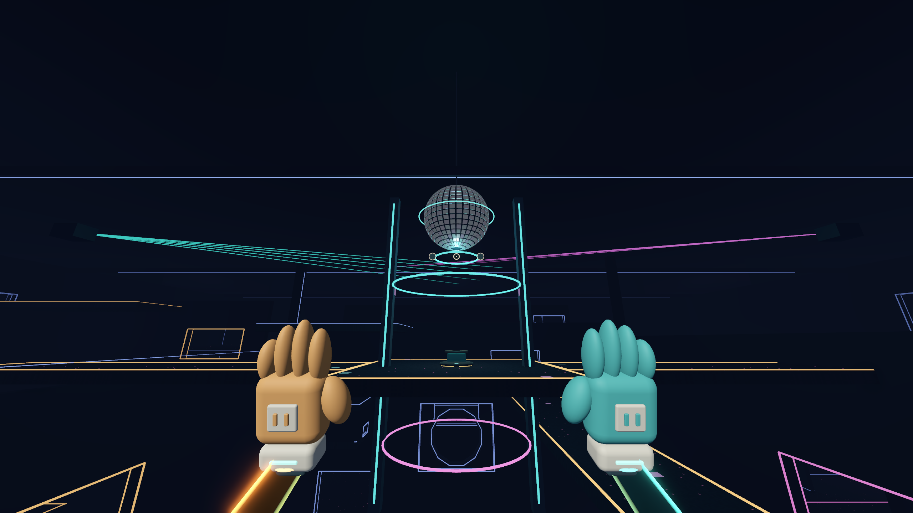

# Surface recoil, soft gloves and the atrium light show

21 September 2026. Current local build; this follows the charge/Spool pass.

## The punch is now a movement impulse

Two-button charging and attack damage/range retain their previous controls. Nearby impacts now add velocity away from the surface instead of replacing velocity with a short upward hop.

- Tap recoil: **9 m/s**. Full charge: **24 m/s**, giving **11.9 m of measured rise from rest** with the current gravity.
- Ground normals push up; wall normals push outward; ceiling normals push down. Contacts from two fists combine, so an inside corner pushes diagonally out.
- Both fists share one impulse budget. A later second contact corrects the direction of that budget rather than adding a second full boost.
- Recoil is full strength within 3 m of the body reference point and smoothly falls to zero at 4.5 m. Distant hits can deal damage without throwing you remotely.
- Incoming velocity is preserved. Pad launch, air steering, recoil and bunny hops can chain. Space no longer replaces an already stronger upward velocity with the ordinary jump speed.
- A grounded horizontal wall blast adds 4 m/s of floor clearance so ground friction does not immediately erase the push. Airborne wall punches do not add that assist.
- The strength power-up scales recoil by the square root of its pull multiplier. The roughly 12 m measurement is unboosted and starts from rest; falling speed or a ceiling changes the resulting trajectory.

The collider is now a 0.105 m radius sphere matching the smaller fist. A center ray accompanies every volume sweep. Regression testing exposed a small-sphere tunneling case against the arena's compound floor; the fallback prevents entering the floor and receiving an arbitrary penetration normal. Solid cover and suppression membranes still stop the attack. The membrane itself does not generate physical recoil.

## Softer, correctly handed gloves

The new original Blender source is `art/build_soft_gloves.py`. Rounded padded palms, continuous fingers, a small spool badge and soft wrist cuffs replace the segmented fingers, plates, seams and metal buckles. Apricot/teal sides remain recognizable.

Thumbs now face inward: positive local X on the left glove, negative X on the right. Open hands and fists are generated directly with positive transforms. Fists have approximately half the earlier model dimensions; they use the same runtime scale as the open hand and a smaller matching hit volume. The parcel and toy asset generators both call this shared source, so a rebuild cannot silently restore the old reversed hands.

## A small number of large effects

The central atrium contains one 4.6 m mirrorball, a thin luminous equator, two five-beam laser fans and 28 moving mirror-light patches. Rotation/sweeps are slow and continuous, without strobes. The sphere is solid and accepts a glove, adding a high anchor to the atrium.

The 640 mirror tiles use one MultiMesh. Lasers and projected patches raycast against architecture; beams terminate at walls and the patches sit on real surfaces. The installation uses one additional unshadowed light and updates its moving geometry at 30 Hz. Pause freezes it. This is a bounded visual budget, not a measured FPS claim. The motion is authored ambient choreography, not beat detection from the five soundtrack files.

Four original 48 kHz rubber/air blast sounds accompany recoil. Each peaks at -8 dBFS before the game's effects gain, with deterministic variations and no new third-party audio. They obey the effects slider and pause mute. The sound builder records measurements in the existing manifest; it does not modify the music.

## Verification

Nine in-engine suites cover 350 assertions. New coverage includes ten-meter charged rise, smaller tap rise, actual pad-launch entry plus recoil, preserving lift through Space, walls, corners, shared impulse strength, distant-hit rejection, bunny-hop momentum, both thumb directions, compact fist bounds, bounded effects, pause and four loaded sound variants. Existing coverage includes solid-cover damage blocking, portals, pad arcs and complete walks up both main ramps.

The complete run passed all 350 assertions. The headless environment still prints root-certificate/user-directory warnings and resource-in-use messages on test shutdown; these are not a clean shutdown validation. Interactive movement feel and hardware frame rate still need player testing.

Reviewed actual upper-atrium, floor, open-glove and charged-fist renders. Reduced mirrorball emission and separated tile rows after the first render looked like a white striped lamp. The existing character rig remains in place; hands are independent projectile/view models rather than newly skeletal fingers.

Reference direction: the user's [Pharah comparison](https://overwatch.blizzard.com/en-us/heroes/pharah/) motivates recoil movement; the [Poppy Playtime reference](https://store.steampowered.com/app/1721470/Poppy_Playtime/) motivates readable toy-like hands. All new mesh and audio assets here are original; no reference-game models, sounds or exact tuning were copied.

Try charging while a pad carries you, punching a nearby floor or wall, and buffering Space on landing. The next balance question is whether the full charge gives enough travel without making every other route irrelevant.
