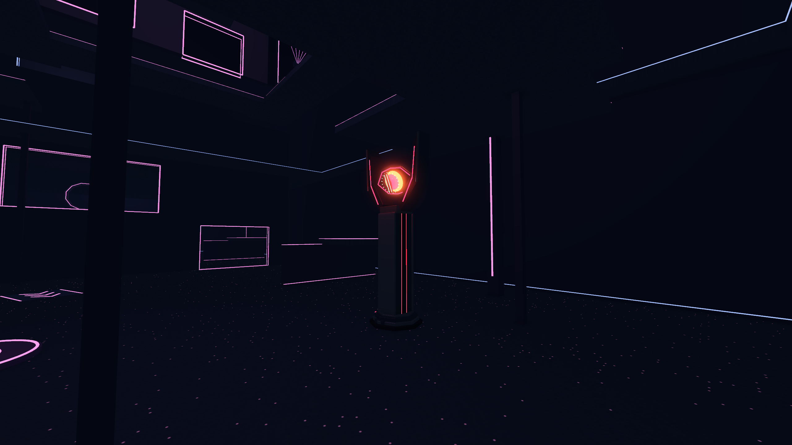
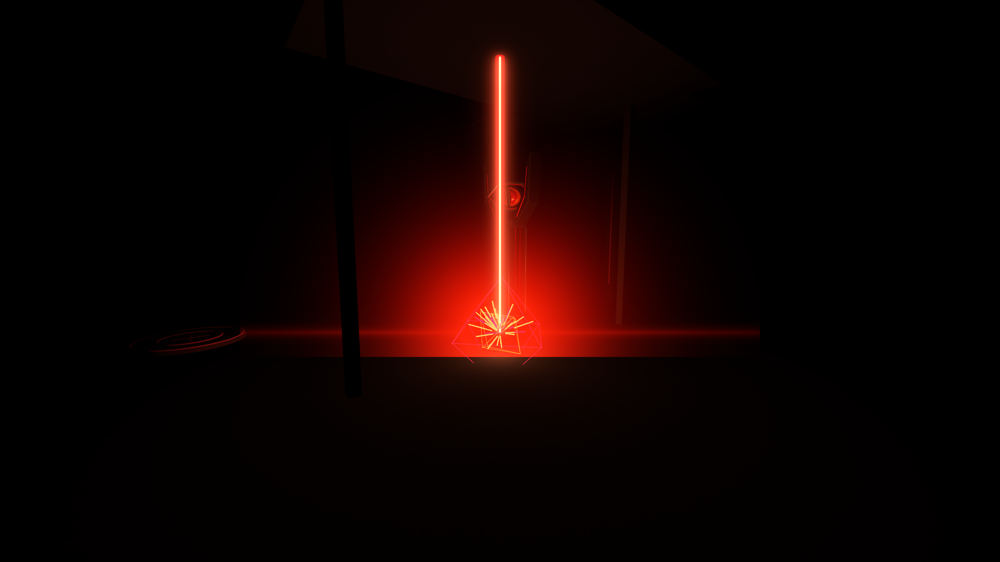
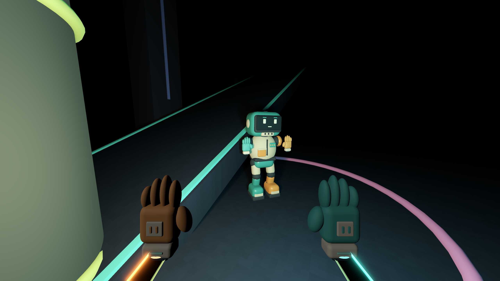

# Sentinel towers, full blackout and neon ordnance

Local prototype revision, September 22, 2026 UTC. The public v0.2.0 release remains unchanged.

## Art and behavior

Seven original Blender-authored Sentinel towers replace the earlier primitive tower arrangement: octagonal footing, recessed ruby shaft channels, swept split crown and a faceted molten eye with a dark vertical pupil. Editable Blender sources and reproducible generator are included. The eye tracks its firing direction; the operator camera excludes crown/eye meshes. Collision remains a simple grippable shaft and damageable eye, not detailed collision on every decorative fork.

E now toggles full blackout immediately, without cooldown or automatic timeout. The controller suppresses decorative emission, unshaded outlines, labels, carpet glow, rave beams, environment/fog illumination and non-hand static lights, then restores their original state. Hand lamps illuminate nearby world surfaces; a small viewmodel-only fill keeps the gloves legible without illuminating the arena. Active weapon effects are deliberately exempt so enemies can see shots and explosions in darkness. Reflected outline paint can still be seen within a hand lamp or explosion's illumination.

Sniper shots use a saturated red tracer; the collision-clipped scoped aiming beam remains visible from the arena. Machine-gun tracers are hot amber. Grenades have a rotating ruby casing, luminous core and trail. Air strikes use angular corner warnings, then a ceiling-clipped red energy column. Explosions replace the old circles with a brief bright flash, two expanding geometric shock fronts, 48 ballistic light shards and a short local light pulse. Maximum eight concurrent bursts; each retires after 1.3 seconds, and pause freezes its lifetime.

Twelve original 48 kHz weapon sounds cover MG, sniper and blast variations; this pass adds a descending bass sweep and chopped electrical tail to blasts. They respect the existing effects slider/master limiter. Audio is still local rather than distance/occlusion-aware, and has not received a human listening pass.

## Verification

- Pilot integration: **133/133** checks, including real input taps/holds, all seven tower sightlines, toggle/restore, active effects in blackout, pause, cleanup and simultaneous burst limits.
- Settings/audio: **24/24** checks. Recoil/hand/rave regression: **19/19** checks.
- Source audit: **104** resource references, unique script UIDs and authoring syntax.
- Twelve WAVs: 48 kHz and non-clipping peaks verified.
- Nine authored 2560 × 1440 engine captures reviewed. Blackout control with hand sources removed has maximum RGB **0**, confirming no residual arena glow in that view.
- Geometric sightline sample: 228/368 standing-clear floor samples visible from at least one eye (61.96%); not a fairness or performance benchmark.

Visual iteration fixed a hidden iris, excessive glove illumination and thick wire-like explosion edges. No desktop control, interactive game launch, networked match or human playtest was performed. Existing certificate-store and shutdown ObjectDB/resource warnings remain in engine logs; these checks reported no script errors. This is a tested art/feedback pass, not a claim of finished production quality.

