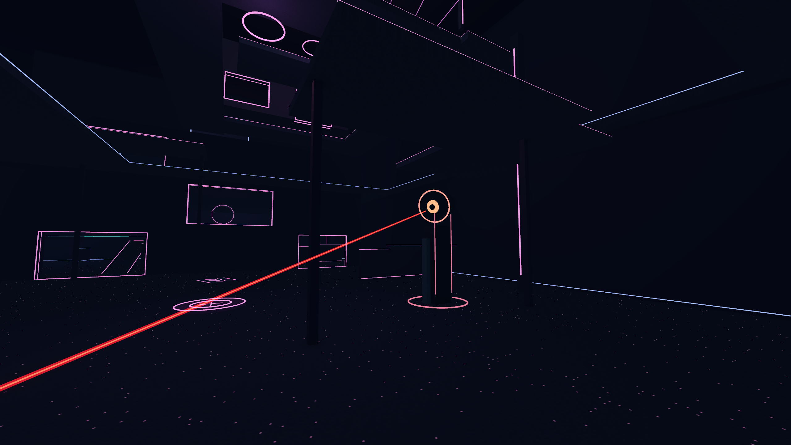

# Watcher weapons — local testing pass

Updated 2026-09-21 Pacific / 2026-09-22 UTC. Current source and local package only; published v0.2.0 remains unchanged.

## What was wrong

The second eye's starting aim hit its own upper side support about 1.28 m away. Shortened those supports beneath the firing level; all seven starting views now have more than 8 m of clearance. Ordinary practice dummies lacked a firearm response. Added bullet/explosion reactions without allowing Watcher hits to award the Fivers' punch task.

The original test called the ray-fire method directly, bypassing input. A press and release between physics ticks could also disappear before a shot. Press now fires immediately, then holding repeats at the weapon interval. Tests now inject events through the game's viewport and exercise actual input routing; they do not automate the user's desktop.

## Current tuning

| Action | Input | Repeat interval | Damage / behavior |
| --- | --- | --- | --- |
| Machine gun | Hold LMB | 0.0333 s | 8 per hit; 2× previous spread; immediate first shot |
| Sniper | Hold RMB, LMB | 0.4 s | 55 per hit; no spread; scoped aiming laser |
| Grenade | Q | 0.5 s | 40 maximum; low rebound, 1 s after landing, 7 m radius |
| Orbital strike | W | 5.0 s | 2.8 s warning; 18 m radius; 70 damage/s for 4 s; solid cover blocks damage |
| Blackout | E | None | Toggles full darkness until pressed again |
| Full auto | R | 1.0 s | Refreshes five-second all-tower burst |

Explosions retain distance falloff and solid-cover occlusion. Punching an eye still disrupts it. Long ability lockouts are removed for this test; this is deliberately permissive tuning, not multiplayer balance.

## Feedback

Twelve original 48 kHz sounds add machine-gun transients, a layered sniper crack/low body/indoor tail, and a heavier explosion. Four variants per category use the existing effects slider and master limiter. Audio is still local feedback rather than distance/occlusion-aware remote audio; human listening is needed to judge the final mix.

A red/orange scoped beam and endpoint follow world collision. Near-camera fading keeps the operator view readable; depth testing preserves solid occluders. Releasing RMB, leaving the role, pausing or eye disruption hides the laser. Persistent scope meshes avoid per-frame allocation.

Tracers, impact sparks, muzzle light, world muzzle flashes, a brief hit marker and a sniper-ready/recharge indicator distinguish aim, fire and impact. Large muzzle flashes are excluded from the operator camera. Cosmetic effects are capped at 64 by retiring old effects; reaching the cap no longer cancels damage or gunfire.

See [Sentinel art pass](SENTINEL-ART-PASS.md) for the subsequent Blender tower, full blackout and angular explosion revisions.

## Evidence from the preceding weapon fix

- Local pilot integration: **124/124 checks**, including all seven real key selections, starting clearance, rapid tap, sustained fire/release, dummy hits and task ownership, scope collision, one-second sniper timing, Q/W/E/R inputs, pause/role cleanup and cosmetic saturation.
- Settings/audio regression: **24/24 checks**. Existing volume defaults and persistence remain intact.
- Resource audit: **95 references**, script UIDs and authoring syntax passed.
- Twelve new WAVs pass 48 kHz, non-clipping peak and quiet-endpoint checks; no claim of listening approval.
- Authored 2560 × 1440 engine renders reviewed from scope, firing and arena viewpoints. The first review exposed an oversized close beam and blinding muzzle flash; both were revised and rendered again.
- Floor visibility after trimming the supports: 226 / 368 samples, **61.4%**. This is geometry evidence, not a gameplay fairness score.

These are focused checks for this change, not a rerun of every earlier suite. Certificate-store and occasional engine shutdown resource warnings remain environmental/test-log limitations. No interactive launch, desktop capture, networked match or human playtest was performed.

Current cargo, weapon tuning and camera-isolated blackout behavior: [carry/night pass](CARRY-NIGHT-PASS.md).

Latest revision: [orbital strike and night-vision startup](ORBITAL-PASS.md).
