# In-engine gallery

The original release gallery below was captured at **3840 × 2160** using the actual Godot renderer, the models and haze from that release, and authored camera positions. Images are unretouched. `tests/capture_showcase.gd` reproduces the staging. These are prototype screenshots, not claims of multiplayer gameplay or final visual quality.

## Gloves and characters

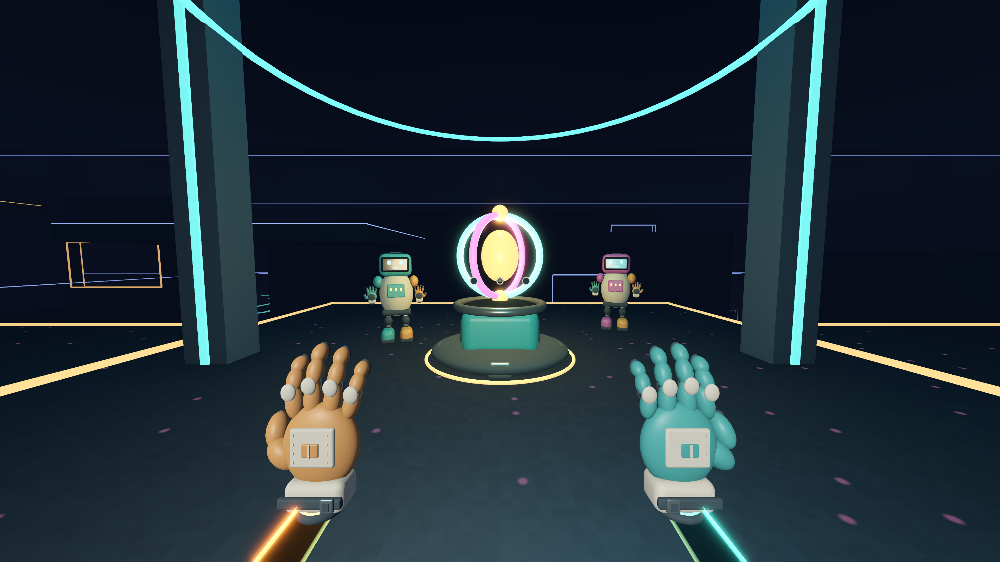

Two differently colored courier models are posed for this screenshot only. They are not bots, connected players or an implemented high-five encounter.

## Vertical routes

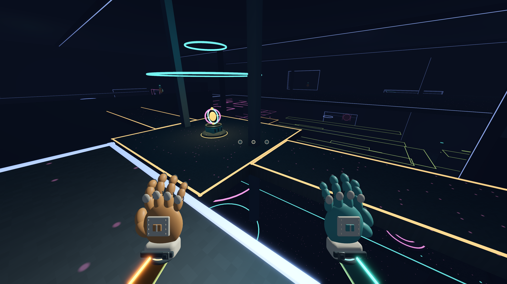

## Linked portals

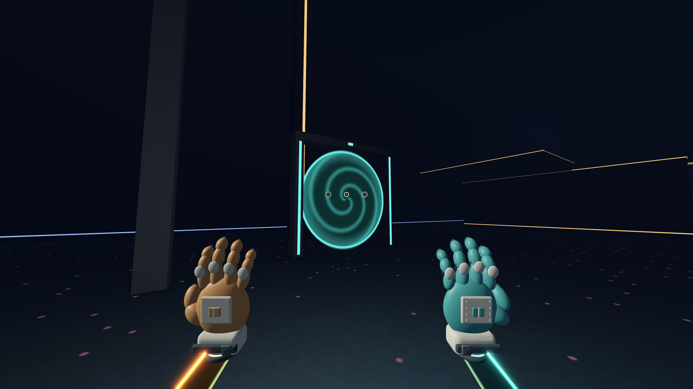

## Red suppression field

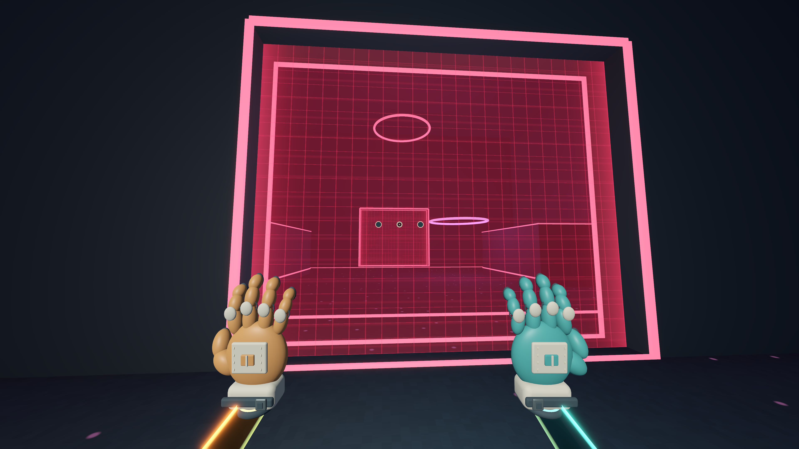

## Distance haze

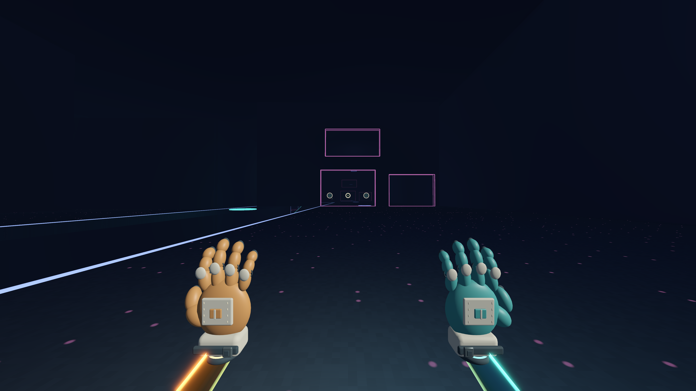

## Minimal menus

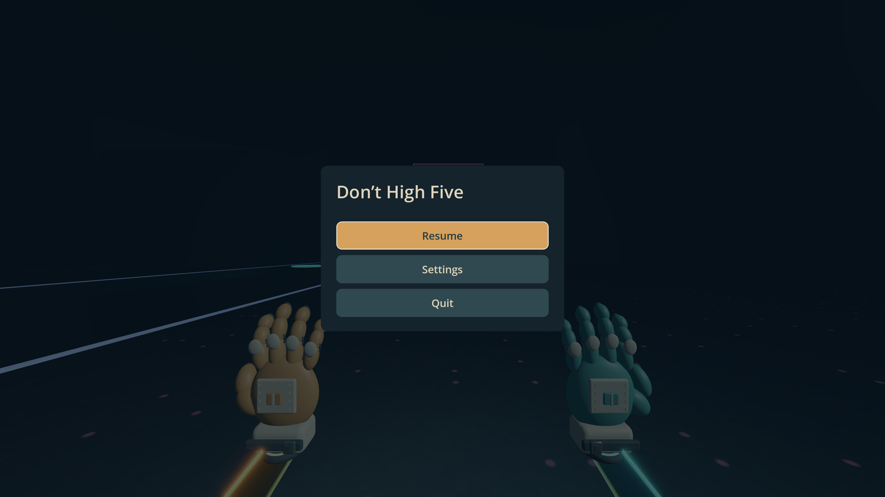

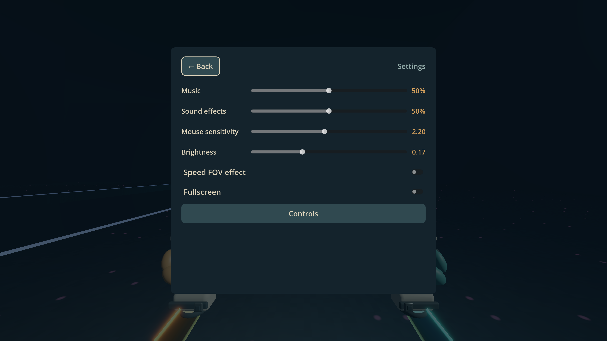

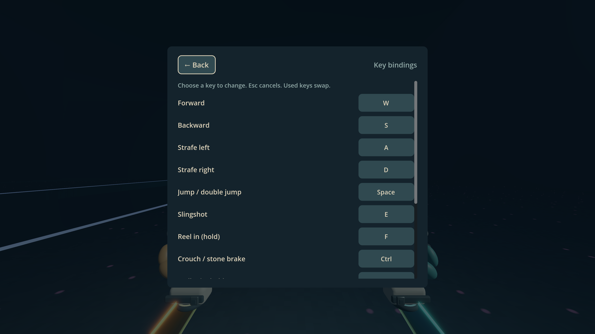

## Latest local arena review

The denser upper maze, terrace stacks and annex bridge bay were captured at **2560 × 1440** with `-- --density-capture`. These are unretouched views of the current local build, newer than the release gallery above.

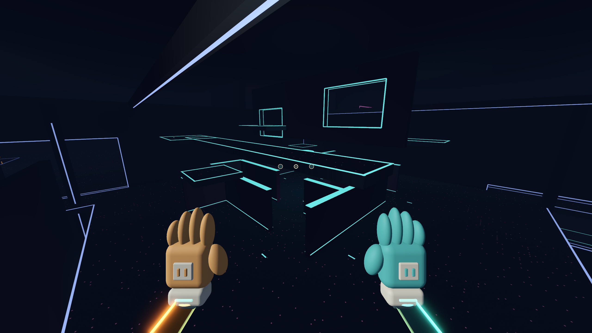

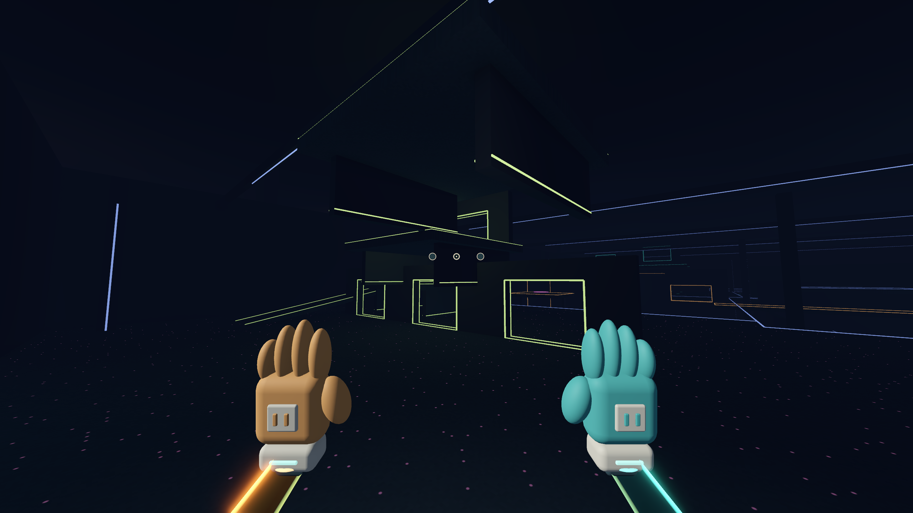

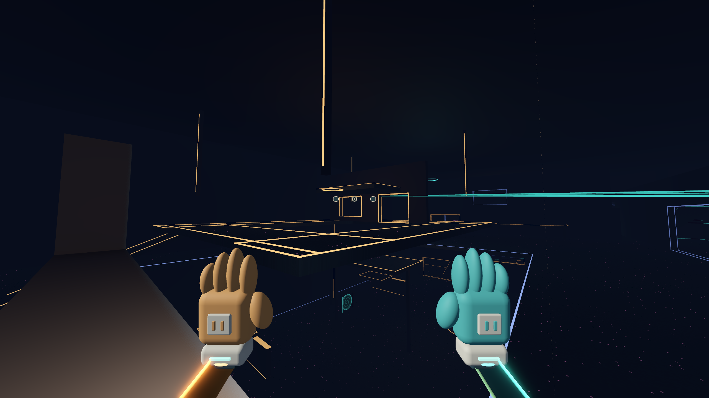

## High Fiver movement pass

2560 × 1440 authored in-engine review frames, 2026-09-21. [Implementation and capture limits](../FIVER-MOVEMENT-PASS.md).

- [Charge pose](fiver-charge.png)
- [Ball charge: shell sockets and curved forearms](fiver-ball-charge.png)
- [Afterimages, deliberately staged for readability inspection](fiver-afterimages.png)
- [Rounded surface stamps](fiver-imprints.png)

Earlier red-field screenshots are historical; the live equipment bay no longer disables arms.

## Local High Fiver / Watcher prototype — 2026-09-21

These 2560 × 1440 engine renders show the later **unpublished local source build**, not the v0.2.0 movement download. The partner is a local simulated character. Views are staged with `tests/capture_pilot.gd`; no desktop capture is involved.

| High Fiver / partner | Watcher eye |
| --- | --- |
| 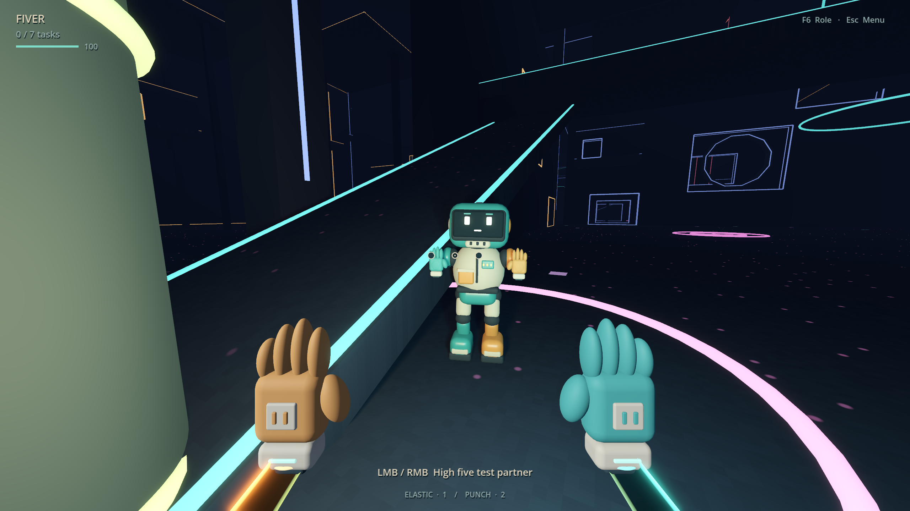 | 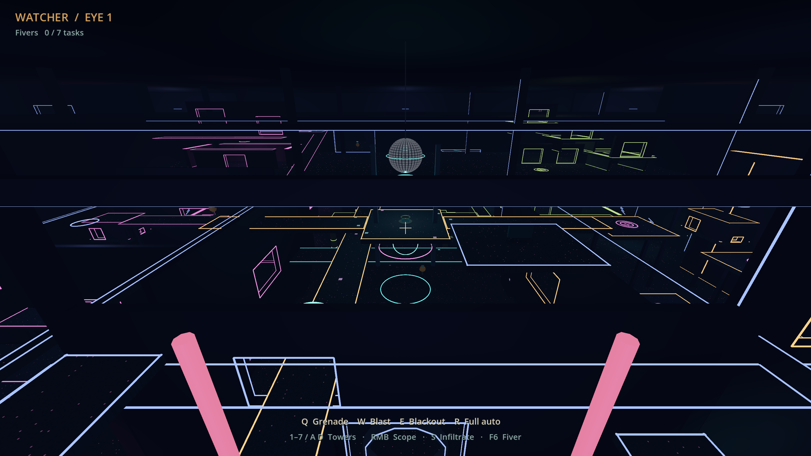 |

| Training | Local test options |
| --- | --- |
| 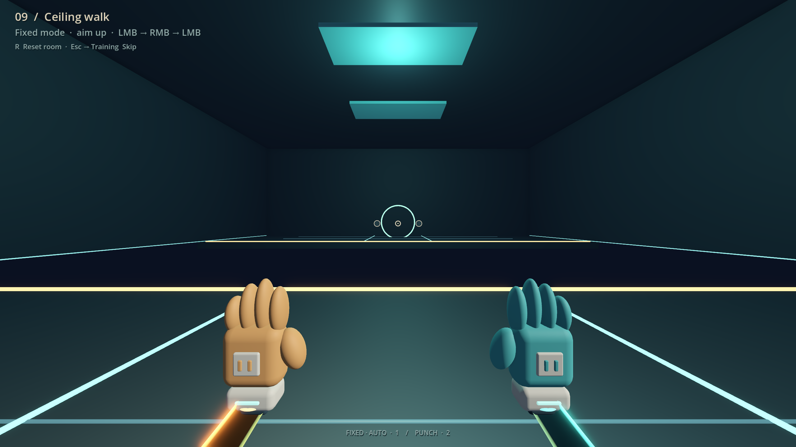 | 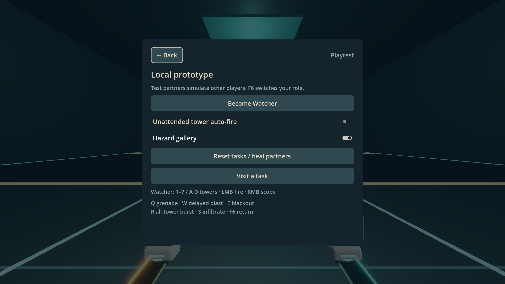 |

[Home menu](pilot-menu.png) · [Jump training](pilot-training.png) · [Blackout](pilot-blackout.png)

## Sentinel pass

`sentinel-*.png` are authored 2560 × 1440 engine renders from `tests/capture_sentinel.gd`: tower, scoped laser, warning, flash, shards, blackout explosion, hand-lit darkness, zero-light control and restored power. They are offscreen render fixtures, not desktop captures. The control deliberately removes hand sources and hides the HUD to check for remaining arena emission.

## Carry / night-vision pass

`night-*.png` are 2560 × 1440 engine render fixtures from `tests/capture_night.gd`, comparing private Watcher night vision with the High Fiver's dark world and temporary attack illumination. These are authored camera views rather than desktop screenshots.

## Orbital pass

`orbital-*.png` are authored 2560 × 1440 renders from `tests/capture_orbital.gd`, including three night-vision transition stages and the sustained area attack.

`crowd-standing.png`, `crowd-collapse.png`, and `crowd-menu.png` are authored 2560×1440 engine captures of the local target/death and test-toggle pass. Orbital captures now show the 180 m visual column.

## Wheel and workshop

`wheel-fiver-front.png` is a 1920 × 1920 authored engine portrait of the original Blender unicycle rig. `wheel-workshop-kit.png`, `wheel-workshop-play.png`, `wheel-reel-hall.png` and `wheel-watcher-mine.png` are 2560 × 1440 engine render fixtures showing the optional example course, real third-person presentation, arena dressing and mine pulse. These are rendered from project assets without desktop capture. The portrait uses studio lighting; workshop editing uses brighter lighting than playtesting.

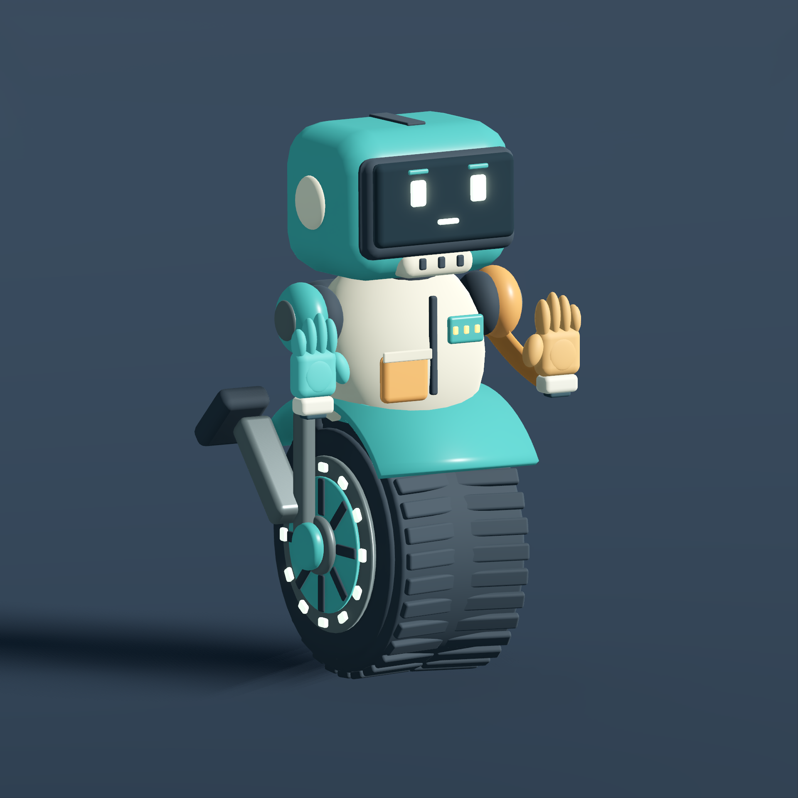

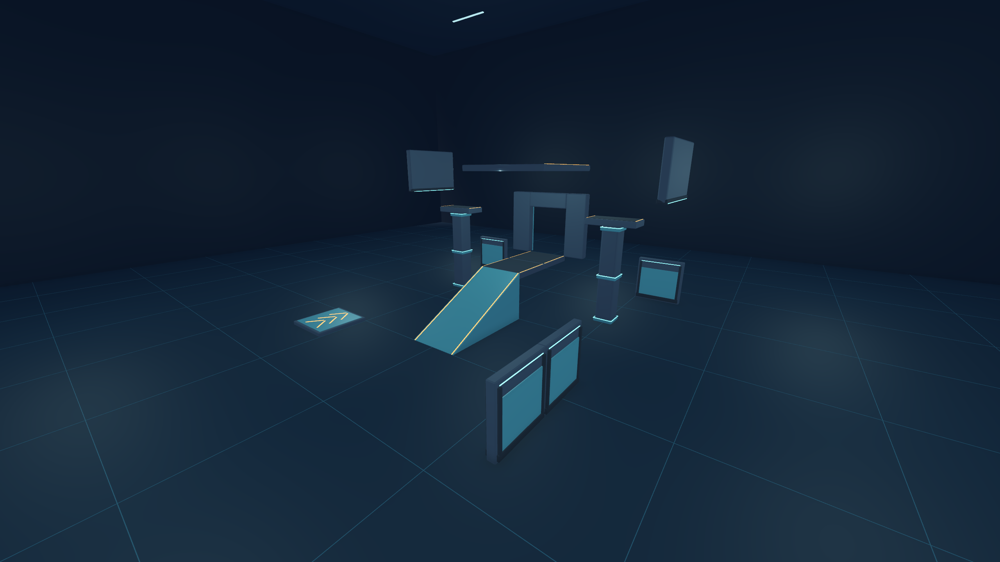

Current controls and visual simplification: [Reveal and patrol pass](../REVEAL-AND-PATROL.md). Blackout moved to F7; E is mine, R is reveal; ambient tower patrols default on.

`minimap-ground.png` and `minimap-upper.png` show the cached local collision map on two actual arena floors, captured by the authored 2560 x 1440 engine fixture `tests/capture_minimap.gd`. No desktop capture was used.
